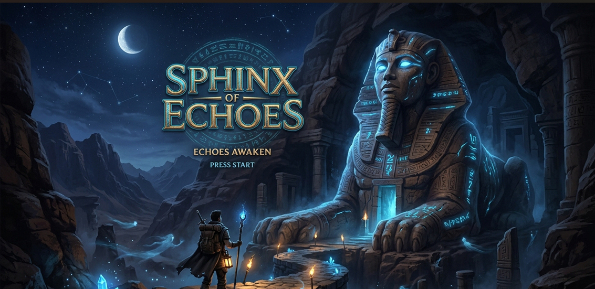
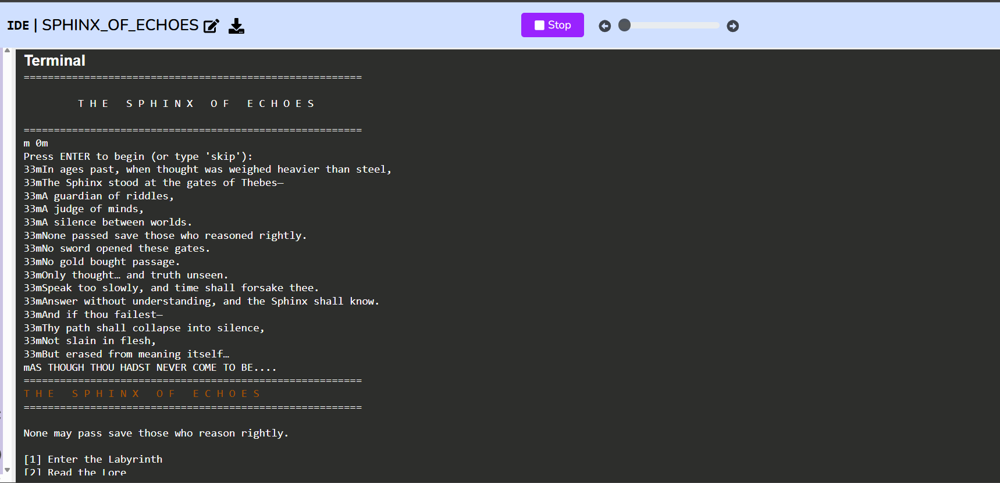
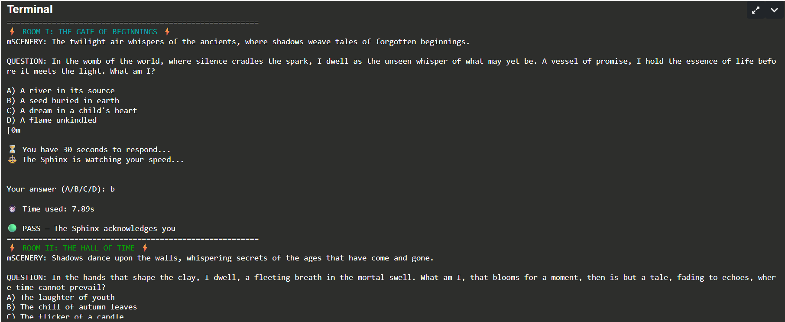
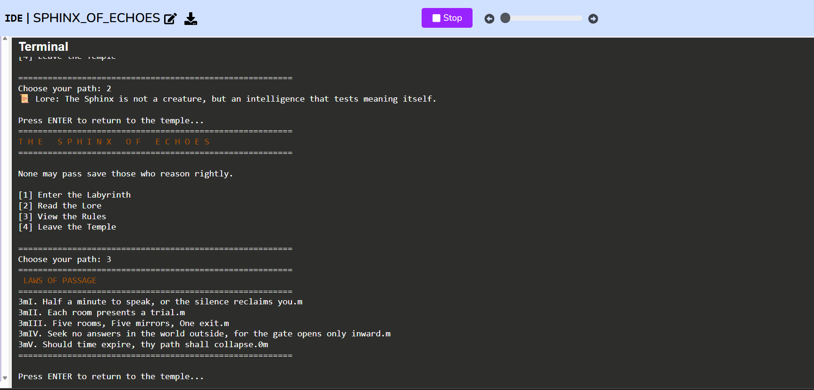
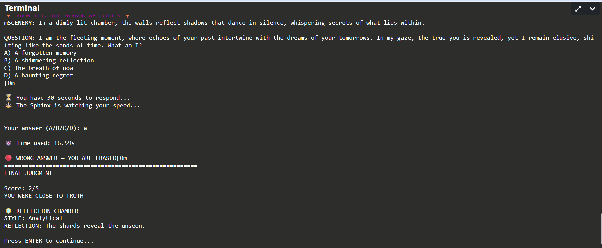

# 🏛️ The Sphinx of Echoes

An AI-powered text adventure game built in Python as my **Stanford University Code in Place 2026 Capstone Project**.

The game combines interactive storytelling, puzzle-solving, and generative AI to create a unique experience where players explore mysterious chambers, answer riddles, and uncover the secrets of the legendary Sphinx.

## Overview

The Sphinx of Echoes is a command-line adventure game inspired by ancient mythology.

Players navigate through mysterious rooms, solve AI-generated riddles, make decisions under time pressure, and receive personalized reflections based on their journey.

The project demonstrates Python programming fundamentals while exploring how generative AI can be integrated into interactive games.

## Features

- AI-generated riddles and story content
- Interactive command-line gameplay
- Multiple themed rooms
- Timed player decisions
- Dynamic storytelling
- Personalized end-game reflection
- Colorful terminal interface
- Replayable experience

## Screenshots

### Title Screen



### Intro



### Rooms



### GamePlay



### Reflection




## Technologies Used

- Python 3
- Stanford Code in Place AI Helper Module (`call_gpt`)
- ANSI Terminal Colors
- Command-Line Interface (CLI)

## Project Structure

```text
Sphinx Of Echoes/
│
├── main.py
├── README.md
├── LICENSE
├── .gitignore
└── images/
```

## Running the Project

During Stanford Code in Place 2026, this project relied on the course-provided AI helper module:

```python
from ai import call_gpt
```

That educational module is no longer publicly available after the course.

As a result, the project cannot be executed without replacing the AI interface with a supported API implementation.

The source code is shared to demonstrate the application's architecture, game logic, and AI integration.
## Skills Demonstrated

- Python programming
- Modular software design
- Interactive game development
- Prompt engineering
- AI integration
- User input validation
- Control flow
- Functions
- Problem solving
## Future Improvements

- Replace the Stanford AI helper with the OpenAI API
- Add save/load functionality
- Introduce player inventory
- Multiple endings
- Sound effects
- Graphical interface (Tkinter or Pygame)
## About the Project

This project was completed as my capstone for **Stanford University's Code in Place 2026** program.

It reflects my interest in combining Python programming, artificial intelligence, and creative storytelling to build engaging user experiences.

## Author

Success Edafe

Clinical Pharmacist | Data Analyst | Python Developer

GitHub: https://github.com/ItsSuccess